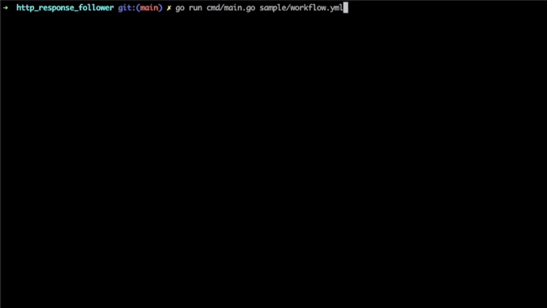

# HTTP Follower

That's a very simple CLI that executes requests in order and make assertions against results.
It loads the workflow from a yaml file 

## Workflow example

```yaml
workflow:
  - request: Access httpbin
    method: GET
    url: https://httpbin.org/get
    retry_period: 2
    assertion:
      name: Expect code 200
      expectedcode: 200
      onfailure: retry
  - request: Access google
    method: GET
    url: https://google.com
    retry_period: 2
    assertion:
      name: Expect code 200
      expectedcode: 200
      onfailure: retry
  - request: Post a message to httpbin
    method: POST
    url: https://httpbin.org/post
    body: '{"message": "hello world"}'
    retry_period: 2
    assertion:
      name: Expect code 200
      expectedcode: 200
      onfailure: retry
```

## Run workflow sample

Within the root folder, execute the command bellow

```
go run cmd/main.go sample/workflow.yml
```

## What you should see


